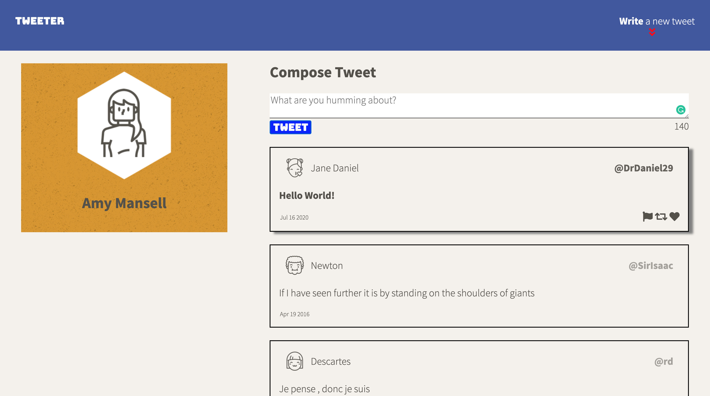
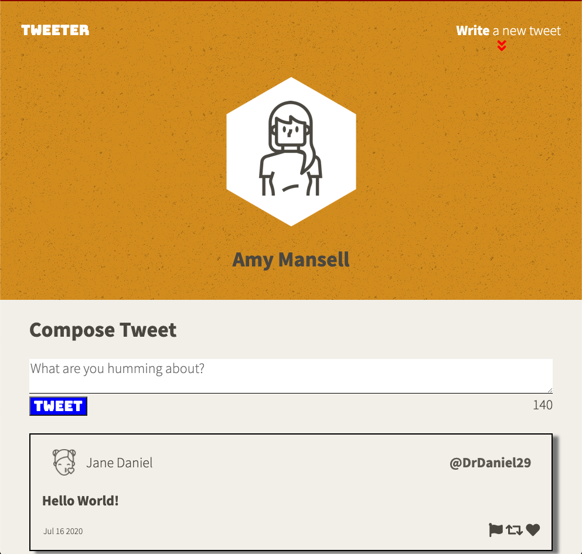
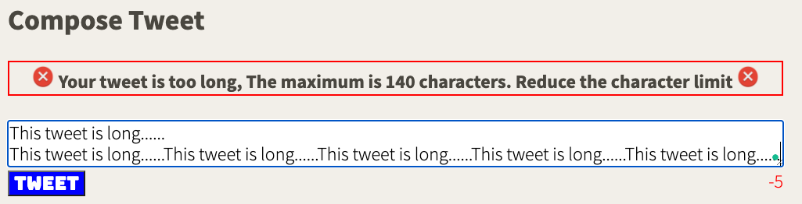
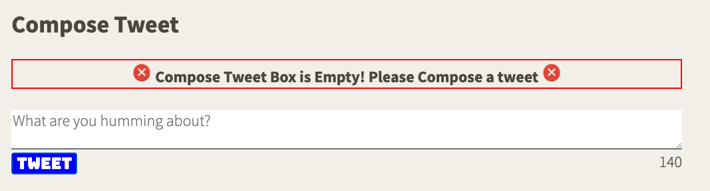

# Tweeter Project

Tweeter is a simple, Single Page App (SPA) Twitter clone built with HTML, CSS, JS, jQuery and AJAX on the client-side, and Node, Express and MongoDB on the server-side.

## Final Product

- Desktop Size
  

- Tablet Size
  

- Long Tweet
  

- No Tweet
  

## Dependencies

- Express
- Node 5.10.x or above
- Body-parser
- Chance
- md5 2.1.0

## Getting Started

1. Fork this repository, then clone your fork of this repository.
2. Install dependencies using the `npm install` command.
3. Start the web server using the `npm run local` command. The app will be served at <http://localhost:8080/>.
4. Go to <http://localhost:8080/> in your browser.
